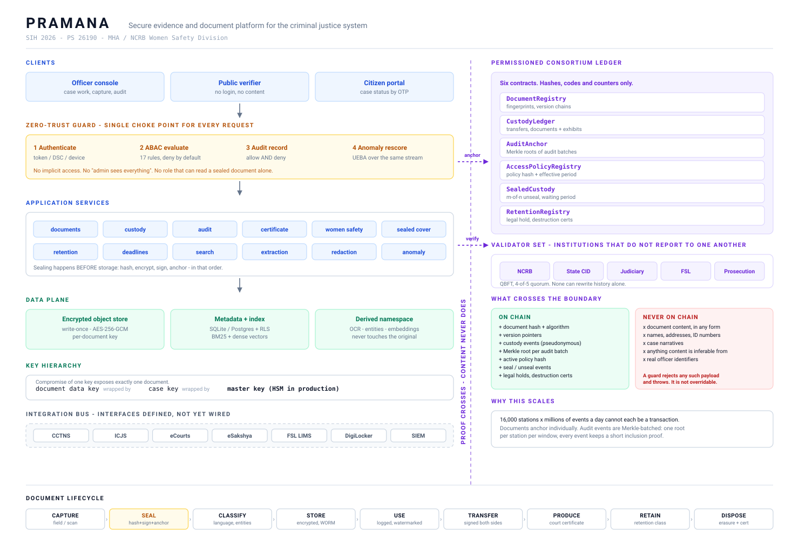

# PRAMANA

**Secure Digital Document Management System for Legal and Investigation Documents**

Smart India Hackathon 2026 · Problem Statement **26190**
Ministry of Home Affairs · National Crime Records Bureau (NCRB), **Women Safety Division**
Category: Software · Theme: Blockchain & Cybersecurity

> **प्रमाण** - the Sanskrit and Indian-jurisprudence term for *proof, the valid means of
> establishing truth*. It backronyms cleanly: **P**rovenance, **R**etention, **A**ccess
> **M**anagement **A**nd **N**otarised **A**rchive.

---

## What this is

A working prototype of the missing layer in India's criminal justice IT stack.

> CCTNS records that a crime happened. eCourts records that a trial happened.
> **Nothing owns the *documents* in between** - their integrity, their custody, their
> confidentiality, their retention. PRAMANA is that layer, and it speaks ICJS at both ends.

Every document is fingerprinted and encrypted the moment it is captured, its fingerprint is
anchored on a permissioned consortium ledger, every access is attribute-checked and permanently
logged, every custody transfer is signed, and any file can be proved unaltered in court - by the
other side, without trusting us.



New here? Read **[docs/PROJECT_BRIEF.md](docs/PROJECT_BRIEF.md)** - what we are building, how the four
core mechanisms work, where we stand, and what is left to finish.

## Run it

Requires **Node.js 22.5+** (24 recommended). No database server, no Docker, no native builds.

```bash
git clone https://github.com/Abhist17/Pramana_190.git
cd pramana
npm install
npm run seed     # builds a fictional corpus: 6 cases, 19 sealed documents, 42 ledger anchors
npm run dev      # API on :4000, console on :5173
```

Open **http://localhost:5173**. Every demonstration account uses the password `pramana`.

| Sign in as | Who they are | What to notice |
|---|---|---|
| `r.deshmukh` | SI Rohini Deshmukh - **woman officer**, assigned to the sensitive cases | Can record victim statements; sees the Women Safety cases |
| `a.pawar` | SI Amit Pawar - assigned only to the general cases | Blocked from the same cases, with the rule that refused him |
| `m.iyer` | DSP Meera Iyer - district supervisor | Rank alone still does not open a Women Safety case |
| `n.banerjee` | APP Nandita Banerjee - prosecutor | Sees exactly what was shared, for as long as it was shared |
| `d.security` | CISO Divya Nair | Reads the audit trail - and has **no path to case content at all** |

Two pages need no login: **/verify** (public verifier) and **/citizen** (case status portal).

### Other commands

```bash
npm test              # 32 unit tests: Merkle, Shamir, envelope crypto, ABAC engine
npm run typecheck     # strict TypeScript across both workspaces
npm run reset         # rebuild the corpus from scratch (restart the API afterwards)
npm run build         # production build of the console
```

## The five things worth showing

**1. The tamper demonstration.** Open any document → *Integrity* → **Flip one bit**. One bit changes
in storage. The fingerprint anchored on the ledger does not, and cannot. Verification fails with a
character-level diff of the two digests. *(The original is backed up first, so it is safe to rehearse.)*

**2. The evidence certificate.** One click produces the certificate the 2023 evidence statute requires -
**pre-filled with the hash and the algorithm**, plus the device, the capture circumstances and the full
custody history, routed for the dual signature the statute demands. The law now asks for a hash. Nobody
has automated producing it. `docs/LEGAL_MAPPING.md`

**3. Access denial you can read.** Sign in as an unassigned Superintendent and open a Women Safety case.
Refused - and told exactly which rule refused him and why. Rank grants nothing; explicit assignment does.
The **Access policy** page simulates any officer against any resource and shows every rule that fired.

**4. Cross-lingual search.** Query `witness saw a maroon vehicle near the school` and the top two results
are handwritten Hindi statements. Query `गवाह का बयान` and it works in reverse.

**5. Hand over the laptop.** Open **/verify**, let a judge drag the file in themselves. It says whether
that exact fingerprint was anchored and when, and nothing about content, case or parties. Integrity stops
being a claim.

A five-minute run of these is scripted in **[docs/DEMO_SCRIPT.md](docs/DEMO_SCRIPT.md)**.

## What is actually built

| Area | Status |
|---|---|
| Capture → hash → envelope-encrypt → sign → anchor | Working, end to end |
| Immutable originals, version chains, renditions | Working |
| ABAC policy engine (17 rules, deny-by-default, version-anchored) | Working, with a simulator |
| Chain of custody, documents **and physical exhibits** | Working, signed both sides |
| Merkle-batched audit log with per-event inclusion proofs | Working, verifiable off-server and **on-chain** |
| Evidence certificate with dual signature + PDF | Working |
| Women Safety module: auto-escalation, identity vault, statutory role enforcement | Working |
| Sealed cover under Shamir *m-of-n* threshold custody | Working |
| Statutory deadline engine with tiered escalation | Working |
| Hybrid search (BM25 + dense vectors, cross-script) | Working |
| True redaction as a separate sealed rendition | Working |
| UEBA anomaly detection | Working, rules layer |
| Retention, legal hold, cryptographic erasure + destruction certificate | Working |
| Public verifier, citizen portal | Working |
| Six Solidity contracts on a permissioned EVM chain | Working, 18 tests, deployable |

**Deliberately simulated, and labelled as such everywhere it appears:** DSC signing (Ed25519 stands in
for CCA-licensed Class 3 tokens), OCR (the corpus ships transcripts; the pipeline treats them exactly as
OCR output, confidence and verification queue included), the embedding model (hashed n-grams with a
curated bilingual lexicon, in place of MuRIL/IndicBERT), HSM key custody (a file, not hardware), and the
CCTNS/ICJS/eSakshya/DigiLocker integrations (interfaces defined, no live systems).

**Deliberately not built:** an offline mobile app, handwriting OCR, predictive policing of any kind.
See `docs/ARCHITECTURE.md` for why the last one is a design decision rather than a gap.

## Repository layout

```
server/          Fastify + TypeScript API
  src/core/      hashing · Merkle trees · envelope encryption · Ed25519 · Shamir over GF(2^8)
  src/policy/    ABAC engine and the baseline rule set
  src/ledger/    anchoring: embedded consortium ledger, or a real permissioned EVM chain
  src/services/  documents · custody · audit · certificates · WSD · search · retention
  src/seed/      the fictional corpus
web/             React + TypeScript console, public verifier, citizen portal
contracts/       six Solidity contracts, Hardhat tests, deploy script (standalone package)
docs/            architecture · demo script · legal mapping · threat model · the solution document
```

## Running against a real permissioned chain

The default is an embedded hash-linked consortium ledger with simulated validators, so the demo boots
with no setup. To anchor to an actual EVM chain instead:

```bash
cd contracts && npm install
npx hardhat node                                    # or point at your QBFT/IBFT network
npx hardhat test                                    # 18 tests
npx hardhat run scripts/deploy.ts --network localhost
cd .. && PRAMANA_LEDGER=evm npm run dev
```

Anchors then become real transactions with real block numbers, and the public verifier resolves against
them. The `AuditAnchor` contract verifies the *same* Merkle proofs the server produces - the test suite
builds a proof in TypeScript and checks it in Solidity, which is the cross-check that matters.

## Honesty notes

- **No real case data is used, and none should ever be loaded into a demo.** Every person, case number,
  phone number and address in the corpus is fictional.
- **Every statutory citation is marked `[VERIFY]`** until it has been checked against
  [indiacode.nic.in](https://www.indiacode.nic.in). Section numbers were written from the problem brief,
  not from the bare Act. Do not put an unverified citation on a slide - see `docs/LEGAL_MAPPING.md` and
  the checklist in `docs/SOLUTION.md` §22.
- **AI output is never evidence.** Extracted text, entities and classifications live in a separate
  namespace, are marked machine-generated with a confidence score, and never touch the sealed original.
- **The chain stores proof, never content.** A guard rejects any anchor payload that looks like personal
  data, and it is not overridable. Inspect exactly what was written on the **Consortium ledger** page.

## Documentation

| Document | What it covers |
|---|---|
| [docs/PROJECT_BRIEF.md](docs/PROJECT_BRIEF.md) | **Start here.** The problem, the four mechanisms, current status, and the remaining work |
| [docs/ARCHITECTURE.md](docs/ARCHITECTURE.md) | How it fits together, and every demo-vs-production gap |
| [docs/DEMO_SCRIPT.md](docs/DEMO_SCRIPT.md) | The five-minute run, with the exact clicks |
| [docs/LEGAL_MAPPING.md](docs/LEGAL_MAPPING.md) | Statutory obligation → feature, with verification status |
| [docs/THREAT_MODEL.md](docs/THREAT_MODEL.md) | Who this is designed against, starting with the insider |
| [docs/LOOPHOLES.md](docs/LOOPHOLES.md) | An adversarial read of our own code: every hole found, verified, and ranked |
| [docs/SOLUTION.md](docs/SOLUTION.md) | The full solution document this was built from |
| [CONTRIBUTING.md](CONTRIBUTING.md) | Working agreements, and who owns what |

## Licence

MIT - see [LICENSE](LICENSE).
