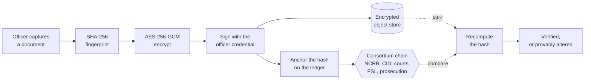
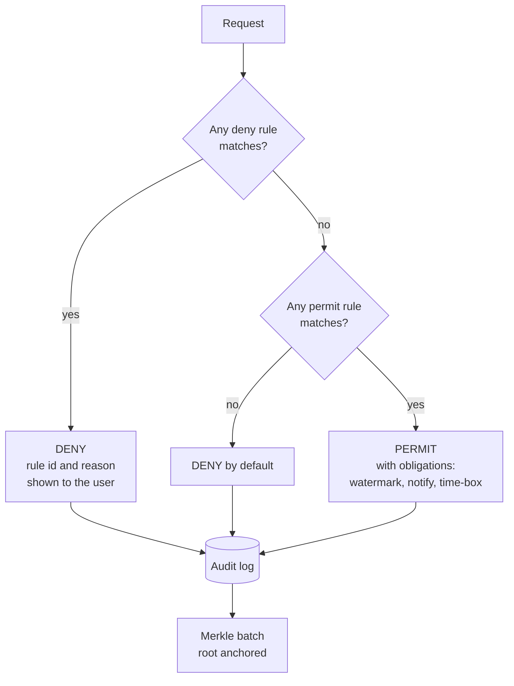

# PRAMANA: what we are building, and what is left

The single document to read before working on this or pitching it.

---

## 1. The one paragraph version

Indian policing generates documents that nobody owns. A case file lives in a physical bundle, on an
officer's personal phone, in a shared email account, on WhatsApp, and in a record room. Nothing proves
those documents are unaltered, nothing controls who reads them, nothing records who looked, and nothing
survives an officer's transfer intact. PRAMANA is the layer that owns them: every document is
fingerprinted and encrypted at the moment of capture, its fingerprint is anchored on a ledger jointly
operated by institutions that do not report to one another, every access is attribute-checked and
permanently logged, and any file can be proved unaltered in court by the other side without trusting us.

## 2. The problem, told properly

This is the version to use with a judge who has never heard of CCTNS. Follow one case file.

**Day 1.** A woman reports an assault. The duty officer handwrites an FIR, then types the same
information into a terminal. A carbon copy goes into a bundle tied with string.

**Day 3.** The investigating officer records witness statements on loose sheets, in the local language.
He photographs the scene on his personal phone. The photos sit in his gallery next to family pictures.
He shares three of them on WhatsApp with his supervisor, who forwards them to a colleague, who forwards
them again.

**Day 12.** A medical report arrives as a scanned PDF on a shared email account whose password four
people know.

**Day 40.** The officer is transferred. He hands the physical file to his successor. Two loose sheets
are missing. Nobody can say when they went missing, or whether they ever existed, because there was
never a list of what the file contained.

**Month 8.** The charge sheet is filed. Court staff re-scan the entire bundle. Page numbers no longer
match, so every reference in the charge sheet points to the wrong page.

**Year 3.** The defence challenges a photograph. The prosecution must prove it is the same one taken at
the scene. The officer has retired, the phone was replaced, there is no hash, no timestamp, no device
record. The photograph is doubted.

**No single step is a scandal. The accumulation is the problem.**

Seven failures fall out of that story, and every one of them maps to something we built:

| Failure | What we did about it |
|---|---|
| You cannot find things | Hybrid search over OCR text, working across Hindi and English |
| The wrong people can read it | ABAC policy engine, deny by default, 17 rules, every decision logged |
| Documents can be altered undetectably | Hash at capture, anchored on a consortium ledger, verifiable by anyone |
| No version control | Immutable originals, explicit version chains, each version separately anchored |
| Departments cannot collaborate | Signed custody transfers, scoped and expiring shares, sealed court bundles |
| Everything is slow, and delay is not neutral | Statutory deadline engine with tiered escalation by rank |
| No audit trail, so no accountability | Append-only log, Merkle-batched and anchored, with per-event proofs |

## 3. Why now

India's criminal law was rewritten in 2023 and took effect on 1 July 2024. The new statutes explicitly
assume digital evidence infrastructure that does not yet exist.

The most important fact in this entire project: **the prescribed certificate for electronic evidence
asks for the hash value of the record and the algorithm used.** The law now asks for a hash. Today an
officer reconstructs that from memory three years after the fact. We generate it automatically at the
moment of production, pre-filled from data captured at seal time.

The new procedure code also created roughly a dozen hard deadlines and several mandatory digital
artefacts. **Nobody has built the compliance layer for them.** Police stations are tracking two-month
statutory deadlines on paper registers. That is the gap. Document storage is a solved problem
everywhere else in the world; statutory compliance for Indian criminal procedure is not.

## 4. Why the sponsoring department matters

The problem statement is owned by NCRB's **Women Safety Division**, not NCRB generally. That is a
deliberate signal and most teams will miss it.

That division owns the systems around sexual offences, offences against children, trafficking and
victim protection. Those files carry obligations no generic document system satisfies: the victim's
identity is legally protected and disclosing it is itself an offence, certain statements must be
recorded by a woman officer, investigation deadlines are measured in weeks, and courts routinely order
material into sealed cover.

So the Women Safety module is not a bonus feature. It is the direct answer to the department that wrote
the brief, and it is the strongest differentiator available.

## 5. How it actually works

Four mechanisms carry the whole system. If you can explain these four, you can defend the project.

### The fingerprint

Feed any file through SHA-256 and you get 64 characters. Change one pixel, one comma, one bit, and that
string changes completely and unpredictably. You cannot work backwards from it to the file, and you
cannot construct a different file with the same fingerprint. So: record the fingerprint when the
document is created, and forever after anyone can recompute it and compare. Match means untouched.
Mismatch means altered. It takes milliseconds.

### The ledger nobody can quietly rewrite

Fingerprints only help if the record of the fingerprint is itself trustworthy. In a normal database,
whoever controls the database can change it, including its timestamps. So we write fingerprints to a
ledger jointly operated by NCRB, the State CID, the judiciary, the forensic labs and the prosecution
directorate. Each holds a copy, each entry is cryptographically linked to the last, and altering a past
entry means simultaneously compromising a majority of independent institutions and rewriting everything
since.

**The document itself never goes on the ledger.** It stays encrypted in government storage. Only the
fingerprint, the timestamp and the custody event go on chain. The ledger proves what existed and when,
while leaking nothing about what it said. A guard in the code rejects any anchor payload that looks
like personal data, and it is not overridable, because an on-chain leak cannot be deleted.

The order matters and is worth saying out loud: the seal is made **before** the document has travelled
anywhere or been seen by a server administrator.

### Access computed, not assigned

Access is not a role name. It is computed per request from rank, unit, district, explicit case
assignment, document sensitivity, the stated purpose, time of day, share grants and break-glass state.
Rules are data, not code, so a change in the law is a policy edit and a new anchored version rather
than a software release.

Evaluation is deny-overrides with an implicit final deny: every deny rule is tested first, then the
permits, and anything nobody explicitly permitted is refused.

The consequence that lands in a demo: an unassigned Superintendent, who outranks everyone in the
station and holds sufficient clearance, still cannot open a Women Safety case. Rank grants nothing.

### The identity that is never there

In a sensitive case the victim's identifying particulars are not in the working documents at all. They
live in a separately encrypted vault, and every document, index entry, search result, notification and
export refers to a stable pseudonym. Revealing the real identity is a distinct privileged operation
requiring two senior approvals, a written justification, and an enforced waiting period during which
every supervisor is notified.

Today, compliance depends on an officer remembering to be careful with a name written in plain text
across forty documents. Here it is structural: **an officer cannot leak what the system never showed
him.**

## 6. Where we stand

Everything in the original build plan is done, plus a fair amount beyond it.

**Working end to end**

- Capture, hash, envelope-encrypt, sign, anchor
- Immutable originals, version chains, derived renditions
- ABAC engine with 17 rules and a live policy simulator
- Chain of custody for documents and physical exhibits, signed by both parties
- Append-only audit log, Merkle-batched, with per-event inclusion proofs
- Evidence certificate with dual signature, rendered to PDF
- Women Safety module: auto-escalation, identity vault, woman-officer enforcement at upload
- Sealed cover under Shamir m-of-n threshold custody
- Statutory deadline engine with tiered escalation
- Hybrid search with genuine cross-script retrieval
- True redaction as a separate sealed rendition
- UEBA anomaly detection
- Retention, legal hold, cryptographic erasure with a destruction certificate
- Public verifier and citizen portal
- Six Solidity contracts, deployable to a permissioned EVM network

**Verified**: 0 type errors, 32 unit tests, 18 contract tests, CI green, clean clone runs.

**Deliberately simulated, and labelled everywhere it appears**: DSC signing, OCR, the embedding model,
HSM key custody, and the partner-system integrations. Being explicit about these is a feature. In a
government-sponsored track, restraint reads as competence, and a claim that does not survive a
follow-up question costs more than the feature was worth.

**Deliberately not built**: offline mobile app, handwriting OCR trained from scratch, and any form of
predictive policing. The last one is a design decision, not a gap, and saying so out loud is worth
points.

## 7. What is left

Four things, in the order they are worth doing.

### Priority 1: the CCTNS and ICJS adapter

**Why it matters most.** A judge from NCRB will ask how this fits with CCTNS. Right now we have no
answer in code. The original plan called for building the adapter interface plus a fake source
returning realistic payloads, precisely because **the interface is what proves you understand the
integration**, even without a live system to connect to.

**What to build.** An `IcjsAdapter` interface with a `MockCctnsSource` that returns realistic IF-1 to
IF-5 shaped payloads, and a "pull from CCTNS" action in the case workspace that ingests one as a
structured record rather than a scan. Roughly an hour.

**What it buys.** The one-line positioning becomes demonstrable rather than asserted: *CCTNS records
that a crime happened, eCourts records that a trial happened, PRAMANA owns the documents in between,
and it speaks ICJS at both ends.*

### Priority 2: break-glass in the officer console

The policy engine enforces it and tests cover it, but there is no button. So we can explain emergency
access and not show it.

**What to build.** A "request emergency access" action on a denied case that takes a written
justification, grants a time-boxed session, fires notifications to two supervisors, and flags the case
audit view permanently. Under an hour, because the policy work is already done.

**What it buys.** A memorable line delivered as a click: *emergency access should be possible, and
uncomfortable.*

### Priority 3: the court bundle generator

One click producing a paginated, indexed, bookmarked electronic brief with an integrity manifest and
the evidence certificates attached.

**What it buys.** This removes days of clerical work per case, which is the clearest operational
benefit in the whole system and the easiest for a non-technical judge to value. Half a day.

### Priority 4: the multi-node consortium demo

Three or four validator nodes in separate containers, visibly agreeing. Mostly theatre, but the
original plan is right that it is surprisingly persuasive on a laptop.

### Not code: the legal verification

Every statutory citation in this repository carries a `[VERIFY]` marker. They were written from the
problem brief, not from the bare Act. Someone has to open indiacode.nic.in and check every one, then
clear the markers. The checklist is in `LEGAL_MAPPING.md`.

**This is the highest-risk outstanding item.** Judges notice a fabricated citation far more often than
teams expect, and a confident wrong section number costs more than an honest unverified marker.

### Not code: the submission itself

Slides, the demo video as a wifi-failure backup, and the SIH submission format. Not started.

## 8. How to talk about it

**The one sentence.** PRAMANA is a zero-trust, blockchain-anchored document and evidence platform for
the criminal justice system: every document is sealed with a cryptographic fingerprint the moment it is
created, every access is attribute-checked and permanently logged, every custody transfer is signed,
and every file can be proved unaltered in court.

**The sentence you want a judge to be able to say.** *"The prosecution has produced a photograph whose
fingerprint was recorded on an independently operated ledger at 14:32 on 3 April, two hours after the
incident, signed by the officer's digital certificate. The photograph before this court produces the
identical fingerprint. It has not been altered."*

**Why this wins**

1. We read the department, not just the problem. The Women Safety module answers the division that
   wrote the brief, while most teams will build a generic document manager.
2. We used the new criminal law as a feature specification. The statutory hash certificate is not
   something we invented; it is something the law demands and nobody has automated.
3. Our blockchain use is defensible. Anchors, not storage. Merkle batching, not one transaction per
   event. A consortium with a real trust argument. We can say in one sentence why a database is
   insufficient, and equally clearly what the chain does not do.
4. We designed against the insider, which is the actual threat in this domain and the one most teams
   ignore entirely.
5. We can prove it live. The tamper demonstration and handing a judge the laptop to verify a file
   themselves are visceral in a way no architecture diagram is.
6. We are honest about limits. On-premise models, human-in-the-loop AI, no predictive policing, no
   fabricated accuracy claims, every simulation labelled.

**The biggest real risk, if asked.** Officers will not adopt it if it is slower than the register. That
is not a cryptography problem. It has to beat paper on the officer's most common action, work offline,
run in the vernacular, and never require the same fact typed twice.

## 9. Where things live

| You want | Go to |
|---|---|
| Run it in two minutes | `README.md` |
| The five-minute demo, click by click | `DEMO_SCRIPT.md` |
| How it fits together, and every demo-vs-production gap | `ARCHITECTURE.md` |
| Statutory obligation to feature, with verification status | `LEGAL_MAPPING.md` |
| Who we designed against | `THREAT_MODEL.md` |
| The original full solution document | `SOLUTION.md` |
| Who owns which directory | `../CONTRIBUTING.md` |
